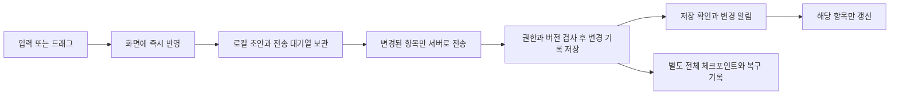

# 협업 편집 안정성과 반응성 개선 조사

조사일: 2026-10-08. 코드 기준: Game Jam! v0.11.0, 커밋 `098b389`.

이후 사용자와 합의한 초안 사본 저장 + 속성별 동기화를 구체화한 [구현 계획](C:/git/game-jam-dev/COLLABORATION_SYNC_IMPLEMENTATION_PLAN.md)을 함께 참고한다.

이 문서는 공개 기술 자료와 현재 코드를 조사한 결과 및 구현 제안이다. 운영 앱·서버의 동작을 변경하거나 실제 공동 프로젝트에서 성능 실험을 실행하지 않았다. 아래 시간·성능 수치는 구현 후 측정할 제안값이며 현재 달성한 수치가 아니다.

## 권장 방향

이번 작업은 **협업 편집 안정성 개선과 성능 최적화**에 해당한다. 작성한 내용이 사라지는 현상은 성능 저하와 별도로 다뤄야 할 데이터 보존 문제다.

추천하는 흐름은 **화면에 즉시 반영 → 로컬에 변경 보관 → 변경된 항목만 서버에 전송 → 서버의 저장 확인 → 해당 항목만 화면에 반영**이다. 서버 저장 간격을 늘리는 것만으로는 이전 내용이나 위치가 되돌아오는 문제를 해결할 수 없다.

우리 앱은 Markdown·이미지·HTML을 실제 파일로 보관하고 AI가 그 파일을 읽는다. 따라서 캔버스 화면과 네트워크·디스크 작업을 분리하면서 파일 호환성, 편집 권한, AI 입력 보호, 실행 취소를 유지하는 방식이 적합하다.

## 다른 협업 도구의 공개된 처리 방식

| 도구                      | 확인한 방식                                                                                                                                                                                                                   | 우리 앱에 가져올 원칙                                                                                                                                                                                                                                                                                                                             |
| ------------------------- | ----------------------------------------------------------------------------------------------------------------------------------------------------------------------------------------------------------------------------- | ------------------------------------------------------------------------------------------------------------------------------------------------------------------------------------------------------------------------------------------------------------------------------------------------------------------------------------------------- |
| Notion                    | 2021년 기술 설명에서는 변경을 먼저 로컬 상태에 적용하고, 로컬에 보관한 거래 대기열을 통해 서버에 전달한다. WebSocket으로 변경된 레코드의 버전을 알리고 필요한 레코드만 다시 가져온다.                                         | 화면 반응을 서버 왕복과 분리하고, 보내지 못한 변경을 로컬 대기열에 보관한다. [공식 기술 설명](https://www.notion.com/blog/data-model-behind-notion)                                                                                                                                                                                               |
| Notion의 동시 텍스트 편집 | 2026년 공개 글은 같은 블록의 마지막 저장만 남기는 방식에서, 문자·서식 변경을 병합하는 CRDT로 전환했고 2025년 7월 운영에 적용했다고 설명한다. 2025년 오프라인 설명에서도 변경 알림과 버전 비교로 불필요한 재다운로드를 줄인다. | 같은 텍스트를 여럿이 동시에 편집하려면 문서 전체 덮어쓰기와 다른 병합 방식이 필요하다. [텍스트 병합](https://www.notion.com/blog/how-notion-handles-concurrent-editing-with-crdts), [오프라인 동기화](https://www.notion.com/blog/how-we-made-notion-available-offline)                                                                           |
| Figma                     | 2019년 공개 설계는 객체의 위치·색 등 속성을 각각 동기화한다. 서버 확인 전인 자신의 변경과 충돌하는 원격 변경을 적용하지 않아 깜박임을 방지한다. 긴 코드 텍스트는 2025년 Code Layers 설명에서 Eg-walker로 별도 병합한다.       | 이동 중/저장 대기 중인 좌표는 로컬 값을 유지한다. 위치와 긴 텍스트에 같은 충돌 정책을 쓰지 않는다. [객체 동기화](https://www.figma.com/blog/how-figmas-multiplayer-technology-works/), [코드 병합](https://www.figma.com/blog/building-figmas-code-layers/)                                                                                       |
| Figma의 복구 기록         | 2022년 설명은 실시간 동기화와 전체 체크포인트를 분리하고, 체크포인트 사이 변경을 write-ahead log에 기록하는 구조를 설명한다.                                                                                                  | 전체 프로젝트 복사를 매 수정의 저장 완료 조건으로 삼지 않는다. 변경 기록을 먼저 안전하게 저장한다. [공식 기술 설명](https://www.figma.com/blog/making-multiplayer-more-reliable/)                                                                                                                                                                 |
| Confluence                | 공개된 **Data Center** 구조에서는 Synchrony와 WebSocket으로 편집 내용을 동기화하고, Confluence에는 주기적으로 공유 초안 스냅샷을 저장한다.                                                                                    | 편집 동기화와 전체 문서 기록을 분리한다. 이 설명을 Confluence Cloud의 내부 구현으로 일반화하지 않는다. [공식 개발 문서](https://developer.atlassian.com/server/confluence/collaborative-editing-for-confluence-server/)                                                                                                                           |
| Miro                      | 공식 도움말에서 WebSocket 연결을 확인하도록 안내한다. 큰 표는 확대 수준과 보이는 영역에 따라 세부 정보를 표시한다. 복구용 보드 버전은 변경이 있었을 때 매시간과 협업 세션 종료 시 백업한다.                                   | 화면의 표시 비용을 줄이고, 실시간 전달과 복구용 전체 버전을 구분한다. Miro의 내부 텍스트 병합 알고리즘·전송 간격은 확인한 자료로 단정할 수 없다. [성능 안내](https://help.miro.com/hc/en-us/articles/360013588560-Board-performance-and-loading-issues), [보드 버전](https://help.miro.com/hc/en-us/articles/360021668819-Board-history-versions) |

다른 도구의 정확한 저장 간격을 그대로 복사하는 것이 목표는 아니다. 공통으로 참고할 부분은 로컬 화면, 변경 전달, 안전한 저장, 복구용 버전을 분리하는 구조다. Miro의 매시간 백업은 실시간 저장을 한 시간마다 한다는 의미가 아니다.

## 현재 코드에서 확인한 사실

| 항목             | 현재 동작                                                                                                                                                  | 개선이 필요한 부분                                                                                                                       |
| ---------------- | ---------------------------------------------------------------------------------------------------------------------------------------------------------- | ---------------------------------------------------------------------------------------------------------------------------------------- |
| 문서 자동 저장   | 입력이 멈추면 800ms 뒤 저장한다. 글자마다 HTTP 저장하는 방식은 아니다. 로컬 초안은 입력 변경 시 `localStorage`에 기록한다.                                 | 입력 경로에서 동기식 저장 비용을 줄이고, 편집 초안과 서버 확인 상태를 명시적으로 관리한다.                                               |
| 서버 변경 확인   | 900ms 간격의 폴링이다. 현재 서버 버전을 보내고 변경이 없으면 파일 본문·파일 버전 목록을 응답에서 생략한다.                                                 | 이미 있는 변경 없음 최적화를 유지하면서, 알림과 변경분 전달을 추가한다. 매 폴링마다 전체 파일을 내려받는 것으로 해석하면 안 된다.        |
| 변경이 있는 응답 | 명령 성공 응답과 새 프로젝트 버전 응답에는 프로젝트 전체 `files`가 포함된다. 이미지 등 자산도 스냅샷에 포함된다.                                           | 작은 문서 수정이나 위치 변경에 무관한 HTML·자산을 다시 보내지 않는다.                                                                    |
| 저장 후 UI 갱신  | 문서 저장 뒤 `loadProject(false)`를 호출한다. `workspace:changed`도 같은 함수를 호출한다. 문서·섹션·HTML·캔버스 목록과 각 HTML 창 상태를 다시 읽는다.      | 저장 응답과 변경 이벤트가 같은 작업을 중복 갱신할 수 있다. 변경된 항목만 적용하고 목록·개인 창 상태를 캐시한다.                          |
| 캔버스 노드      | 관련 상태가 바뀌면 문서·섹션·미리보기 노드 목록을 다시 구성한다. 드래그 중인 노드 위치는 보존한다.                                                         | 드래그가 끝난 뒤 서버 확인까지의 위치 보존은 별도 상태가 필요하다. 변경 없는 노드의 참조와 에디터 상태를 유지한다.                       |
| 서버 저장        | 명령을 프로젝트별 대기열에서 처리하고, 새 체크포인트 폴더에 **모든 파일과 전체 프로젝트 상태**를 기록한 뒤 성공 응답한다. 파일 기록은 순차적으로 수행한다. | 작은 수정도 전체 프로젝트 크기와 파일 수에 영향을 받는다. 뒤에 대기한 저장·조회·잠금 요청까지 지연될 수 있다.                            |
| 앱의 협업 캐시   | 전체 파일·버전·초안·전송 대기 상태를 JSON으로 만들고 해시를 계산해 캐시 파일을 갱신한다. 저장 명령에는 전송 전 대기 기록과 응답 후 기록이 있다.            | 안전한 대기 기록은 유지하되, 큰 HTML·이미지를 포함한 전체 JSON 재직렬화를 줄인다.                                                        |
| HTML 창 이동     | 창 위치·크기는 개인 PC에 저장한다. 문서 위치와 달리 공동 프로젝트 명령으로 서버에 올리지 않는다.                                                           | HTML 끊김은 서버 저장 빈도만으로 설명할 수 없다. 전체 노드 갱신, 개인 상태 읽기/쓰기, 여러 게임의 CPU·렌더링 비용을 분리 측정한다.       |
| HTML 실행        | 원본 HTML 내용은 `useMemo`로 처리하며 iframe의 재시작 키는 명시적 재시작에 연결돼 있다.                                                                    | 일반 화면 갱신만으로 게임을 다시 실행하지 않는 기존 보호를 유지한다. 최적화하면서 iframe을 불필요하게 없애면 게임 상태가 사라질 수 있다. |

근거 코드: [자동 저장과 초안](C:/git/game-jam-dev/src/ui/App.tsx:461), [저장 후 다시 읽기](C:/git/game-jam-dev/src/ui/App.tsx:2233), [프로젝트 목록 재조회](C:/git/game-jam-dev/src/ui/App.tsx:1894), [노드 재구성](C:/git/game-jam-dev/src/ui/App.tsx:2694), [900ms 폴링](C:/git/game-jam-dev/src/collaboration-client.ts:539), [변경 없는 응답 생략](C:/git/game-jam-dev/src/collaboration-server.ts:668), [전체 체크포인트](C:/git/game-jam-dev/src/collaboration-server.ts:183), [순차 파일 기록](C:/git/game-jam-dev/src/project-store.ts:103), [협업 캐시](C:/git/game-jam-dev/src/main.ts:448), [개인 HTML 창 저장](C:/git/game-jam-dev/src/main.ts:3093), [HTML 실행 창](C:/git/game-jam-dev/src/ui/App.tsx:1025).

이미 초안 보관, 편집 중 서버 본문으로 교체하지 않는 처리, 저장 요청 직렬화, 문서 버전 검사, 요청 ID 재사용, 오래된 서버 응답 배제, 오래된 화면 로드 배제가 있다. 이를 없애고 새로 시작하기보다 빠진 보호와 과도한 작업을 보완해야 한다.

## 증상별 판단과 재현할 항목

1. **작성한 글이 사라짐:** 현재 코드만으로 원인을 확정하지 않았다. 편집 중 초안 보호가 있으므로 서버 조회 자체가 항상 글을 덮어쓴다고 할 수 없다. 저장 응답이 늦게 왔을 때 최신 초안 처리, 한글 조합 중 에디터 내용 교체, 카드 재생성/편집 종료, 프로젝트 전환 경계를 먼저 재현한다. 화면에서만 사라졌는지, 실제 서버 파일에도 누락됐는지 구분한다.
2. **메모를 놓은 위치가 되돌아옴/끊김:** 현재 드래그 위치 보존은 `dragging` 상태에 연결돼 있다. 마우스를 놓은 뒤 저장 확인 전에 다른 갱신이 오면 이전 좌표가 반영될 가능성이 있다. 이는 코드상 의심 경로이며 느린 연결로 재현이 필요하다.
3. **작은 저장도 오래 걸림:** 전체 체크포인트와 전체 응답은 확인한 구조적 비용이다. 실제 지연의 비중은 서버 파일 기록, 네트워크, 앱 캐시, UI 갱신을 따로 측정해야 한다.
4. **HTML 이동 끊김:** HTML 자체의 CPU 사용과 게임 수, 전체 노드 갱신, 개인 창 상태 저장을 따로 측정한다. HTML 창 위치 저장이 서버를 왕복한다고 전제하지 않는다.

진단에는 문서 내용·이미지·키·토큰을 수집하지 않는다. 요청 ID, 프로젝트/파일의 익명 식별자, 버전, 변경 바이트 수, 대기 시간, 서버 처리 시간, 저장 시간, 화면 반영 시간, 프레임 지연만 기록한다. 서버 재연결과 다른 팀원의 작업이 동시에 있었는지도 구분한다.

## 우리 앱에 맞는 개선 구조

### 1. 작성 중인 초안 보호

- 문서마다 최신 초안, 서버가 확인한 내용, 전송 중인 내용, 수정 순번을 구분한다. 저장 확인은 **해당 요청이 보낸 순번까지** 반영한다. 저장 중 새로 입력한 글은 초안에 남겨 다음 전송 대상으로 유지한다.
- 서버 내용은 확인된 사본에 적용하고, 미저장 초안이 있으면 편집기의 본문·커서·선택·실행 취소 내역을 교체하지 않는다. 충돌이 나면 두 내용을 보존하고 선택할 수 있게 한다.
- 한글 입력 조합 중에는 에디터 전체 내용을 교체하거나 편집을 종료하지 않는다. 조합이 끝난 뒤 최신 초안을 저장한다. 원문 모드와 서식 모드를 모두 검사한다.
- 기존 문서 편집 잠금과 버전 검사를 첫 단계에서 유지한다. 같은 문서의 진짜 동시 입력은 이후 텍스트 병합 단계에서 별도로 다룬다.
- 저장 지연이나 실패로 입력을 막지 않는다. 상태는 `로컬 보관됨`, `서버 동기화 중`, `동기화 완료`, `연결 끊김`, `충돌 확인 필요`를 구분한다.
- 프로젝트·캔버스 전환 전 로컬 초안을 확실히 기록한다. 전송 대기열은 프로젝트별로 유지하고, 원격 저장 확인 전 편집 잠금을 성급히 해제하지 않는다. **AI 실행 전에는 사용될 입력의 서버 저장 완료까지 확인**해 이전 파일로 생성하지 않도록 한다.

### 2. 이동과 크기 변경의 즉시 반응

- 이동 중에는 화면 좌표만 갱신한다. 마우스를 놓으면 최종 좌표를 하나의 저장 작업으로 보낸다. 현재도 드래그 종료 시 저장하므로 이 원칙은 유지한다.
- 저장 확인 전까지 `이동 저장 대기` 상태를 유지해 오래된 서버 좌표가 화면을 되돌리지 못하게 한다. 연속 이동 시 아직 보내지 않은 좌표는 마지막 위치로 합친다.
- 같은 항목을 다시 움직인 경우 첫 번째 저장 확인으로 두 번째 위치를 지우지 않는다. 권한 거절·AI 잠금·다른 팀원의 이동 충돌은 이유를 표시하고 복구한다.
- 여러 항목/섹션의 이동은 한 거래로 처리해 일부만 옮겨지는 일을 막는다. 다른 항목이나 다른 속성의 원격 변경은 계속 받는다.
- 위치·크기와 문서 내용은 화면 상태 및 변경 처리에서 분리한다. 파일로 기록할 때는 최신 본문과 frontmatter를 합쳐 기존 Markdown 형식을 유지한다.
- 삭제·캔버스 구조 변경·AI 실행처럼 검증과 원자성이 필요한 작업은 일반 드래그와 동일하게 단순 합치지 않는다.

### 3. 전체 재조회와 전체 화면 갱신 축소

- 저장 응답에 변경 경로·버전·필요한 내용을 담고, 해당 문서/섹션/HTML만 업데이트한다. 모든 저장 뒤 `loadProject`를 호출하는 경로를 제거한다.
- 변경 알림은 파일 경로와 변경 종류를 포함한다. 명령 응답과 같은 변경 알림은 요청 ID·버전으로 중복 적용하지 않는다. 여러 파일이 함께 바뀐 알림은 한 번의 화면 적용으로 묶는다.
- 변경되지 않은 문서·노드·콜백의 참조를 유지하고, 커서/접속 상태 변경이 문서 본문과 모든 캔버스 노드를 다시 만드는 경로로 번지지 않게 한다.
- HTML 목록 전체의 개인 창 상태를 매번 디스크에서 읽지 않는다. 프로젝트 진입 시 읽어 캐시하고 이동 시 그 항목만 기록한다.
- HTML·이미지는 내용이 실제 바뀐 경우에만 갱신한다. HTML 실행 창의 불필요한 재시작이나 마운트 해제를 피한다. 다수 HTML 게임의 동시 실행 비용은 별도 계측한다.
- 전체 스냅샷은 최초 연결, 기록 공백 이후 복구, 서버 변경/캐시 오류와 같이 필요한 경우에 사용한다. 전체 사본을 받아도 미저장 로컬 변경을 보존해 다시 적용한다.

### 4. 변경 알림과 전송 비용 축소

현재 HTTP 저장 명령과 요청 ID 재시도 구조를 유지하면서 **SSE로 서버 변경 알림을 받는 방식**을 1차로 추천한다. 서버 → 앱 알림만 필요하므로 기존 구조를 크게 바꾸지 않고 시작할 수 있다. 이 선택은 우리 코드에 대한 설계 제안이며 다른 도구가 SSE를 쓴다는 의미는 아니다.

- 알림에는 전체 프로젝트 대신 연속 변경 번호와 변경된 경로/버전을 담는다. 문서·레이아웃·탭·멤버/잠금 상태를 구분하고 필요한 변경분만 가져온다.
- Electron의 메인 프로세스에서 인증된 스트림을 관리한다. 연결과 재연결은 화면 렌더링과 분리한다. 권한 취소와 프로젝트 변경 시 기존 연결을 종료한다.
- 마지막 적용 번호를 기준으로 재연결한다. 변경 기록이 남아 있으면 누락분을 받고, 없으면 전체 복구 후 로컬 대기 변경을 다시 적용한다.
- SSE가 끊기면 간격을 조절한 폴링으로 보완한다. 알림이 온 뒤 HTTP로 **전체 파일을 다시 조회하는 것만으로는** 핵심 전송 비용이 줄지 않으므로 파일 변경분 API도 같이 구현한다.
- 접속 확인·문서 잠금 갱신·AI 작업 임대 갱신을 별도로 관리한다. 현재 잠금과 AI 임대는 30초이므로 폴링 간격만 늘려 만료시키지 않는다.
- 이미지와 큰 지원 파일은 내용 해시를 기준으로 캐시하고 필요할 때 전송한다. 위치 수정 응답에 이미지 본문을 반복 포함하지 않는다.

향후 실시간 커서·드래그 중 위치 중계·텍스트 병합이 필요해지면 WebSocket을 검토한다. 통신 수단 변경만으로 데이터 덮어쓰기나 전체 디스크 기록 문제가 자동 해결되는 것은 아니다.

### 5. 서버 기록과 복구 비용 축소

전체 파일 복사를 저장 응답의 필수 작업에서 분리하고, **변경된 파일·거래 ID·버전·히스토리를 트랜잭션으로 기록**하는 구조를 추천한다. 단일 PC 서버라는 조건에서는 SQLite 기반 변경 저장소를 우선 검토할 수 있다. WAL은 변경 기록과 체크포인트를 분리하지만 디스크 동기화 설정에 따라 전원 장애 시 보존 특성이 다르므로, 저장 완료는 실제 내구성 확보 후에만 응답해야 한다. [SQLite 공식 문서](https://sqlite.org/wal.html)

- 한 명령의 자료 변경, 버전 증가, 요청 ID 중복 방지, 히스토리는 함께 확정한다. 기록 완료 전 성공 응답이나 다른 팀원에게 확정 알림을 보내지 않는다.
- HTML/이미지/지원 파일은 내용이 같은 사본을 매 명령마다 새 폴더에 복사하지 않는다. 변경 기록과 파일 내용 저장을 분리하고 동일 내용은 재사용한다.
- 전체 프로젝트 체크포인트는 일정 시간·변경량 기준으로 만든다. 체크포인트를 늦추더라도 서버 재시작 때 저장 완료한 변경을 복구할 수 있어야 한다.
- 현재 히스토리와 실행 취소 의미를 보존한다. 버전 목록의 표시를 요약하는 것과 실행 취소용 개별 거래를 없애는 것은 구분한다.
- 구형 `head.json`/체크포인트를 읽어 변환하고, 변환 실패 시 원본으로 복구할 수 있게 한다. AI 시작·파일 탐색기 열기·내보내기에 필요한 실제 파일 구조는 그대로 제공한다.

### 6. 같은 문서의 동시 입력은 후속 단계

같은 메모를 두 사람이 동시에 타이핑하도록 하려면 텍스트 병합이 필요하다. 현재 Tiptap은 Yjs를 연결하는 Collaboration 확장을 제공하므로 후보가 된다. 다만 자체 실행 취소와 원문 Markdown 편집, 외부 파일 변경, AI 파일 수정과의 경계를 설계해야 한다. [Tiptap 공식 문서](https://tiptap.dev/docs/editor/extensions/functionality/collaboration)

이 기능을 모든 성능 개선의 선행 조건으로 삼지는 않는다. 기존 한 문서 편집 잠금을 유지하면서도 초안 보호·이동 반응성·부분 동기화·서버 기록 비용을 먼저 개선할 수 있다. 위치의 마지막 변경 우선 정책을 긴 본문 전체에 적용해서는 안 된다.

## 제안하는 초기 간격

다른 서비스에서 측정한 수치가 아니라, 구현 후 네트워크/PC 조건에 맞춰 조정할 시작값이다.

| 작업                          | 제안값                                                        | 원칙                                                                                                                          |
| ----------------------------- | ------------------------------------------------------------- | ----------------------------------------------------------------------------------------------------------------------------- |
| 화면 입력·드래그              | 즉시                                                          | 서버 왕복을 기다리지 않는다.                                                                                                  |
| 로컬 초안 보관                | 변경을 약 300ms 단위로 합치고 편집/프로젝트 종료 시 즉시 기록 | 입력 중 동기식 전체 저장을 줄이되, 저장하지 않은 구간이 존재함을 인정하고 복구 검사한다.                                      |
| 문서 서버 전송                | 입력이 멈춘 뒤 약 1초, 계속 입력할 때 최대 약 3초마다         | 한글 조합 중단 없이 확정된 최신 내용을 보낸다. 미전송 변경은 최신 초안으로 합친다.                                            |
| 이동·크기 서버 저장           | 조작 종료 시 최종값                                           | 즉시 로컬 반영, 서버 확인까지 최종값 유지.                                                                                    |
| 접속·잠금·AI 임대 갱신        | 약 5초                                                        | 현재 30초 임대를 유지하며 저장 대기열에 갇히지 않도록 한다.                                                                   |
| 알림 장애 시 변경 폴링        | 사용 중 약 3초, 비활성 상태 약 10초부터 조정                  | 변경 확인과 잠금/AI 갱신을 분리한다. 재시도 실패에는 기존 지수 백오프를 유지한다.                                             |
| 전체 프로젝트 복구 체크포인트 | 변경이 있을 때 약 30~60초 또는 변경량 기준                    | 그 사이 변경은 이미 안전한 거래 기록에 저장돼 있어야 한다. SQLite 내부 WAL 체크포인트와 앱 전체 프로젝트 체크포인트는 별개다. |

## 구현 순서와 통과 기준

| 단계                         | 범위                                                                               | 반드시 통과할 검사                                                                                                                                       |
| ---------------------------- | ---------------------------------------------------------------------------------- | -------------------------------------------------------------------------------------------------------------------------------------------------------- |
| 0. 원인 재현과 기준 측정     | 느린 응답, 다른 팀원의 수정, 한글 입력, 저장 중 재입력, 메모/HTML 이동을 독립 재현 | 입력부터 표시·로컬 저장·서버 확정까지의 시간을 구분. 현재 데이터 유실 경로와 화면만 되돌아가는 경로를 구분.                                              |
| 1. 초안과 위치 보존          | 요청별 수정 순번, 대기 초안, 이동 확인 대기 상태, 한글 조합 보호                   | 늦게 온 저장 확인으로 새 글/새 위치가 사라지지 않음. 다른 카드 수정 중 커서·선택·실행 취소 유지. 실패 시 초안 복구 가능.                                 |
| 2. 부분 갱신과 저장 비용     | 변경 항목만 UI/캐시 반영, 전체 재조회 제거, 서버 거래 기록과 체크포인트 분리       | 메모 이동으로 무관한 이미지/HTML을 보내거나 다시 기록하지 않음. 서버 강제 재시작 후 저장 확인 받은 변경 복구. 기존 히스토리·AI 입력 파일·폴더 구조 보존. |
| 3. 알림 기반 동기화          | 인증된 SSE, 변경분 API, 누락 복구, 폴링 보완, 독립 임대 갱신                       | 연결 끊김·재연결·서버 재시작·권한 취소·구버전 앱에서 올바르게 복구/차단. AI 입력 잠금과 다른 자료 편집 허용 유지.                                        |
| 4. 필요하면 동시 텍스트 병합 | Tiptap/Yjs 후보 검증, 원문/외부 파일/AI/실행 취소 경계                             | 같은 문서의 동시 입력, 오프라인 입력, 서식 및 원문 호환을 별도 검증.                                                                                     |

성능 목표는 우선 로컬 입력 반영 p95 50ms 이내, 일반 이동 60fps에 가까운 반응, 다른 항목의 변경으로 에디터 전체 재설정 0회, 같은 내용의 HTML 창 불필요한 재시작 0회로 잡는다. PC·문서 길이·게임 실행 부하별로 측정하며 현재 달성했다고 주장하지 않는다.

검사에는 2명/5명 참여, 서버 왕복 지연 약 200/500/1500ms, 응답 유실과 중복 재전송, 일시 연결 끊김, 저장 직후 앱 종료/서버 재시작을 포함한다. 자료 규모는 작은 프로젝트와 문서 100개·HTML 10개·이미지 50개·복수 캔버스 프로젝트를 비교한다. 성능뿐 아니라 원문·이미지·결과물·실행 취소·AI 보호가 유지되는지를 같이 검증한다.

첫 구현에서는 **1~2단계를 먼저 완료**해 글과 이동 위치 보존을 확보하고, 3단계로 변경 전달을 가볍게 만드는 순서를 추천한다. 기존 기능 테스트 외에도 지연·중복·재연결 상태를 재현하는 검사가 필요하다. 앱과 협업 서버의 새 기능 지원 여부를 확인하고 함께 배포한다.
